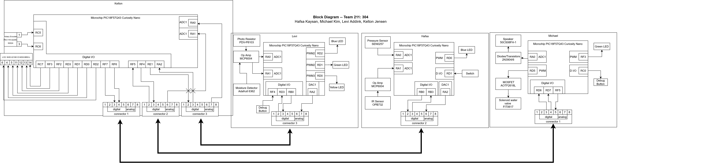
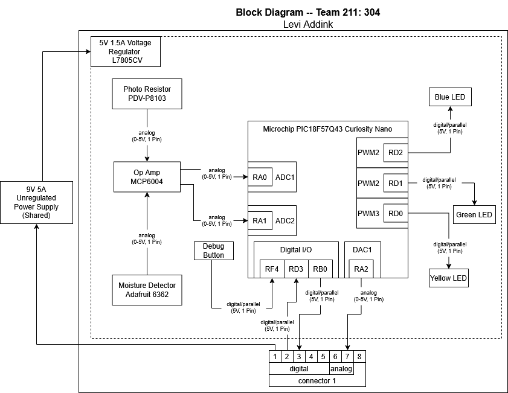

## Overview

Team 211's device consists of four unique subsystems each with a PIC microcontroller to fulfill its desired function as an automated irrigation system, as shown by these block diagrams. The main hub, designed by Kelton, will provide a shared power from a wall mounted power supply and communication between the boards using 8 pin connectors while also displaying information through an LCD screen with a rotary encoder for user input and screen selection. To detect any failures in the irrigation system or to alert the user that the water storage tank connected to the device is running low, Hafsa's subsystem is designed to read, translate, and send information from a pressure sensor connected to the tubing and an IR sensor mounted inside the tank to Kelton's board. Levi's board uses a photoresistor nearby the plant and a moisture sensor in the soil to detect whether or not the plant is getting enough sunlight and when the plant needs more water and send that data to Kelton's board. Michael's subsystem recieves information from Kelton's board about the other sensors based on their state and activates or deactivates a solenoid valve in the tubing if the plant soil is too dry and a speaker alarm if their are failures in the system.

**Figure 1:** Team Block Diagram and Connections. PDF version [*here*](pdf/TeamBlockDiagram.pdf)

## Individual Block Diagrams

**Figure 2:** Kelton Jensen's [Main Hub Subsystem](https://kjensen37.github.io/EGR304DataSheetKeltonJensen.github.io/01-Block-Diagram/Block-Diagram)
___
   

**Figure 3:** Hafsa Kaysan's [IR Reflective Sensor and Pressure Sensor Subsystem](https://hfsksn.github.io/01-Block-Diagram/Block-Diagram/)
___

**Figure 4:** Levi Addink's [Moisture and Sunlight Sensor Subsystem](https://blobiathan.github.io/01-Block-Diagram/Block-Diagram/)
___

**Figure 5:** Michael Kim's [Solenoid and Speaker Subsystem](https://mjkim21-dev.github.io/01-Block-Diagram/Block-Diagram/)

___

## Connections Table

