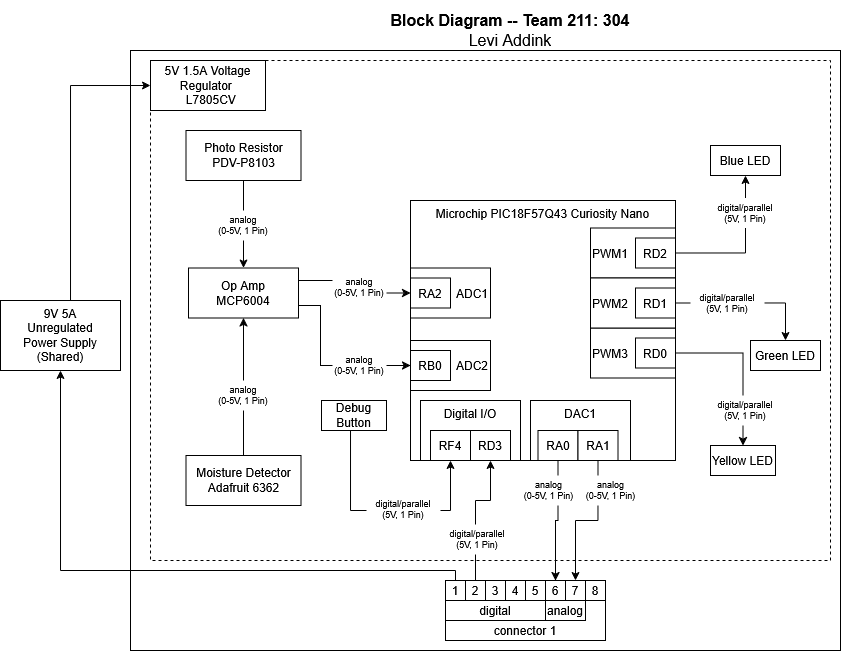

## Overview

...

**Figure 1:** Team Block Diagram and Connections. PDF version [*here*](pdf/TeamBlockDiagram.pdf)

## Individual Block Diagrams
   

**Figure 2:** Hafsa Kaysan's [IR Reflective Sensor and Pressure Sensor Subsystem](https://hfsksn.github.io/01-Block-Diagram/Block-Diagram/)
___

**Figure 3:** Levi Addink's [Moisture and Sunlight Sensor Subsystem](https://blobiathan.github.io/01-Block-Diagram/Block-Diagram/)
___

**Figure 4:** Michael Kim's [Solenoid and Speaker Subsystem](https://mjkim21-dev.github.io/01-Block-Diagram/Block-Diagram/)
___

**Figure 5:** Kelton Jensen's [Main Hub Subsystem](https://kjensen37.github.io/EGR304DataSheetKeltonJensen.github.io/01-Block-Diagram/Block-Diagram)
